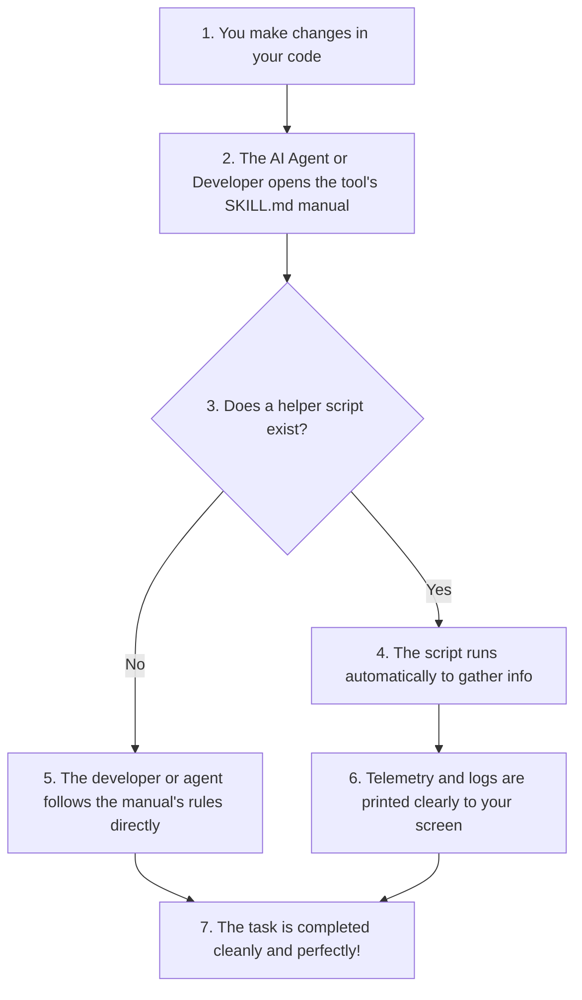

# The Friendly Developer Toolchain 🚀

Welcome to the **Dev Toolchain** repository! This is a simple, highly organized home for custom development tools, automation scripts, and workflow guidelines. 

Whether you are a developer looking to automate your daily tasks, a teammate looking for standard workflows, or a recruiter exploring clean codebase designs—we are glad you are here!

---

## What is This Project About? 💡

When building software, developers often waste time on repetitive manual tasks: formatting code, checking repository states, writing out pull request descriptions, or typing long setup commands. 

This repository solves that by organizing all of our development tools into a single, modular system. It acts as a **"Skill Library"** where each tool lives in its own cozy folder and contains:
1. **Clear Guidelines:** A simple, easy-to-read manual telling developers and AI assistants how to use the tool.
2. **Optional Automation:** A helper script that handles the boring terminal commands for you in one click.

By keeping our tools version-controlled and neatly separated, we make our projects faster to build, easier to collaborate on, and much more fun to develop!

---

## How It's Organized 📂

To keep things neat and easy to find, every tool in this library follows a clean, consistent folder pattern:

```text
[tool-name]/
├── SKILL.md            # 📖 The Instruction Manual (Mandatory)
└── [tool-name].sh      # ⚡ The Helper Script (Optional)
```

### 1. The Instruction Manual (`SKILL.md`)
This is the heart of each tool. Written in plain Markdown, it is designed for both human developers and AI pair programmers to read. It explains:
- What the tool does in plain English.
- The rules and best practices to follow.
- A friendly checklist to verify that everything works beautifully.

### 2. The Helper Script (`[tool-name].sh` - Optional)
Some folders don't need scripts and are just simple manuals. But for the ones that do, we include a clean, lightweight script. The script does the heavy lifting, gathers info, and runs commands automatically—saving you from typing them out by hand!

---

## How a Tool Runs 🔄

Here is a quick look at what happens behind the scenes when a tool in this library is put to work:



---

## Standard Extensibility: How to Register Skills 🛠️

In modern, professional AI assistant platforms, you do not need to deal with low-level host commands or manual folder structures. These platforms natively support standard package managers and dynamic discovery hooks.

Depending on your specific agent runtime environment, registration is handled through one of three standard pathways:

### 1. Dynamic Workspace Auto-Discovery (Zero Setup)
Modern developer agent runtimes recursively scan your open repository workspace when you launch a session. 
- **How it works:** The agent searches the active project directories for any `SKILL.md` configurations. 
- **The result:** Simply opening the project workspace in your editor instantly registers and activates the tool, with no setup required!

### 2. Built-In Skill Installer Commands
Most professional platforms support a native skill installation CLI or console command to register modules from either local directories or remote repositories.
- **Remote Installation (From GitHub):** Install a specific tool directly from a shared repository URL using an explicit path parameter:
  ```bash
  agent skill install <repo-url> --path <sub-folder>
  ```
- **Local Installation (From Your Machine):** Register a tool directly from your local development workspace folder:
  ```bash
  agent skill install <local-directory-path>
  ```

### 3. User Directory Registration
If you want the skill globally available across all projects on your machine, place the tool folder into the platform's standard global skill directory (typically found under your user's home configuration directory):
- **How it works:** Place the folder directly into the platform's configured `skills` or `tools` folder.
- **The result:** A simple restart of the agent application or CLI after copying the folder will activate the new skill globally.

---

## Platform Quick-Reference 🚀

To make integration immediate, here is how the general registration concepts map directly to the industry's leading AI developer platforms:

| Platform | Registration Method | How to Do It |
| :--- | :--- | :--- |
| **Claude Code** | Workspace Auto-Discovery | Simply open this repository folder using `claude` in your terminal. The tool context and markdown instructions are automatically discovered and loaded! |
| **Agy** | User Directory / Project Path | **Project-Specific:** Copy the tool directory into your project's agent folder: `cp -r [tool-name] .agents/skills/`<br>**Global:** Copy into the global skills path: `cp -r [tool-name] ~/.gemini/skills/` |
| **Codex** | Chat Interface Installer | Type `$skill-installer` in the Codex chat window and provide the local folder path (or repository URL) to install it instantly. |
| **GitHub Copilot** | GitHub CLI Extension | Install the skill directly into your Copilot environment using the GitHub CLI: <br>`gh skill install ./[tool-name]` |
