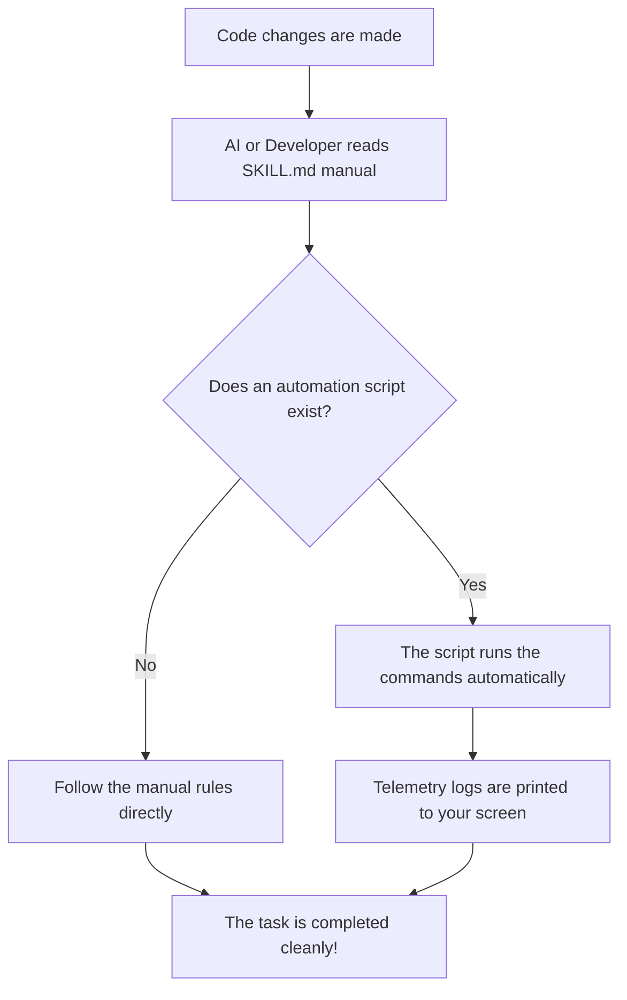

# 🛠️ Dev Toolchain

The **Dev Toolchain** is a portable library of standardized AI agent skills and automation workflows. Built under the `SKILL.md` open standard, it establishes a modular, language-agnostic platform to orchestrate consistent developer workflows, enforce commit compliance, and coordinate structured incident root cause analysis across diverse LLM clients.

---

## 🚀 How It Works

This repository is built as a robust, modular library:

- **Every tool has a guide:** The manual (`SKILL.md`) tells both developers and AI assistants how to use the tool.
- **Orchestration scripts automate tasks:** Some tools include an optional shell script to handle terminal commands automatically.

---

## 🛠️ Available Skills

The toolchain contains the following core engineering skills:

| Skill | Directory | Primary Purpose | Status |
| :--- | :--- | :--- | :--- |
| **Commit Prepper** | [`prepare-commit/`](prepare-commit/SKILL.md) | Enforces staging hygiene, repository state audits, and drafts semantic commit specs. | **Active** |
| **ADR Generator** | [`adr-gen/`](adr-gen/SKILL.md) | Standardizes architectural pivots and trade-off matrices with immutable indexing. | **Active** |
| **Test Scaffolding** | [`generate-tests/`](generate-tests/SKILL.md) | Scaffolds language-specific, table-driven unit test suites without external AST dependencies. | **Active** |
| **RCA Generator** | [`rca-gen/`](rca-gen/SKILL.md) | Standardizes incident post-mortem documentation and timelines under `docs/incidents/`. | **Active** |

---

## 📂 Folder Layout

Every tool inside this repository follows a simple pattern:

```text
[tool-name]/
├── SKILL.md            # [Required] The manual file telling the agent what to do
└── [tool-name].sh      # [Optional] The script that runs the commands automatically
```

### 📖 The Manual (`SKILL.md`)

This is a declarative text file that contains:

- What the tool does.
- The rules and constraints to follow.
- A checklist to verify that everything works.

### ⚡ The Script (`[tool-name].sh` - Optional)

If present, the automation script runs the terminal audits and orchestration commands automatically. Diffs and log commands are set to output raw text directly to prevent terminal page hangs.

---

## 🔄 Orchestration Flow: Lifecycle of a Skill



---

## 📥 How to Register Skills

Instead of copying files, you register the folder path so the AI always reads the original source files. This prevents duplicate files and version drift.

### 🔍 Workspace Auto-Discovery

Modern AI tools scan your open folder automatically. If they find a `SKILL.md` file, they load it instantly. No setup command is needed.

### 💻 Built-In Installer Commands

Most platforms let you install skills by running a simple registration command pointing to the local folder or the remote GitHub repository URL:

- **From GitHub:**

  ```bash
  agent skill install <repo-url> --path <folder-name>
  ```

- **From Your Machine:**

  ```bash
  agent skill install <local-folder-path>
  ```

---

## 📋 Platform Quick-Reference

| Platform | Registration Method | How to Do It |
| :--- | :--- | :--- |
| **Agy** | User Directory / Project Path | **Project-Specific:** Copy the folder into your project agent folder: `cp -r [tool-name] .agents/skills/`<br>**Global:** Copy into the global skills path: `cp -r [tool-name] ~/.gemini/antigravity-cli/skills/[tool-name]` |
| **Codex** | Chat Interface Installer | Type `$skill-installer` in the Codex chat window and provide the folder path to install. |
| **GitHub Copilot** | GitHub CLI Extension | Install the skill directly using the GitHub CLI: <br>`gh skill install ./[tool-name]` |
