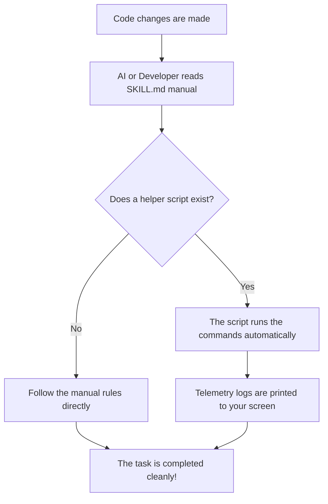

# 🛠️ Dev Toolchain

This repository is a collection of helper tools and guides for coding. It helps developers and AI coding assistants automate boring tasks, stage changes cleanly, and keep git commit history neat.

---

## 🚀 How It Works

This repository is built as a simple, modular library:
- **Every tool has a guide:** The manual (`SKILL.md`) tells both developers and AI assistants how to use the tool.
- **Helper scripts automate tasks:** Some tools include an optional shell script to handle terminal commands automatically.

---

## 📂 Folder Layout

Every tool inside this repository follows a simple pattern:

```text
[tool-name]/
├── SKILL.md            # [Required] The manual file telling the agent what to do
└── [tool-name].sh      # [Optional] The script that runs the commands automatically
```

### 📖 The Manual (`SKILL.md`)
This is a simple text file that contains:
- What the tool does.
- The rules and steps to follow.
- A simple checklist to verify that everything works.

### ⚡ The Script (`[tool-name].sh` - Optional)
If present, the script runs the terminal commands for you automatically so you do not have to type them out by hand. Diffs and log commands are set to output raw text directly to prevent terminal page hangs.

---

## 🔄 Flow Diagram: Lifecycle of a Tool



---

## 📥 How to Register Skills

Instead of copying files, you register the folder path so the AI always reads the original source files. This prevents duplicate files and version drift.

### 🔍 Workspace Auto-Discovery
Modern AI tools scan your open folder automatically. If they find a `SKILL.md` file, they load it instantly. No setup command is needed.

### 💻 Built-In Installer Commands
Most platforms let you install skills by running a simple registration command pointing to the local folder or the remote GitHub repository URL:

- **From GitHub:**
  ```bash
  agent skill install <repo-url> --path <folder-name>
  ```
- **From Your Machine:**
  ```bash
  agent skill install <local-folder-path>
  ```

---

## 📋 Platform Quick-Reference

| Platform | Registration Method | How to Do It |
| :--- | :--- | :--- |
| **Agy** | User Directory / Project Path | **Project-Specific:** Copy the folder into your project agent folder: `cp -r [tool-name] .agents/skills/`<br>**Global:** Copy into the global skills path: `cp -r [tool-name] ~/.gemini/antigravity-cli/skills/[tool-name]` |
| **Codex** | Chat Interface Installer | Type `$skill-installer` in the Codex chat window and provide the folder path to install. |
| **GitHub Copilot** | GitHub CLI Extension | Install the skill directly using the GitHub CLI: <br>`gh skill install ./[tool-name]` |
